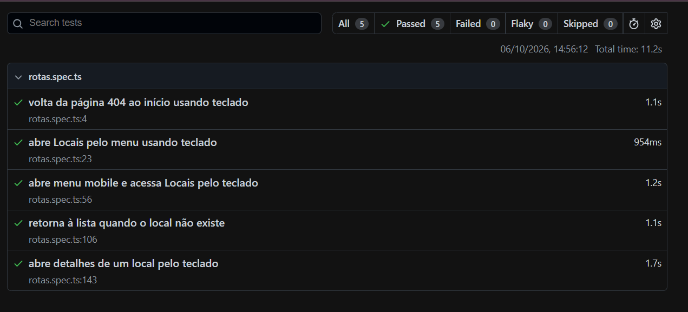

# QA — Issue #60: rotas e navegação por teclado

## Ambiente
- Windows
- Node.js v24.21.0
- Chromium instalado pelo Playwright
- Branch: test/60-rotas-teclado
- Data: 06/10/2026

## Testes automatizados
Comando: npx playwright test --headed

| Cenário | Resultado |
| --- | --- |
| Abrir URL inexistente e voltar ao início com Tab e Enter | Passou |
| Acessar Locais pelo menu com Tab e Enter | Passou |
| Abrir menu mobile e acessar Locais pelo teclado | Passou |
| Acessar local inexistente e voltar à lista pelo teclado | Passou |
| Abrir detalhe de local pelo teclado e recarregar a página | Passou |

Resultado: 5 testes aprovados, 0 falhas.

## Verificações
- npm run build: passou.
- npm run lint:
  O Windows impediu o carregamento do arquivo nativo do Oxlint,
  com a mensagem "An Application Control policy has blocked this file".
  (provável erro na própria máquina, esperar passar para análise)

## Evidências

## Limites deste ciclo
Os testes cobrem dois fluxos em viewport de desktop.
Ainda não foram verificados menu mobile, demais rotas,
modal e visibilidade visual do foco.